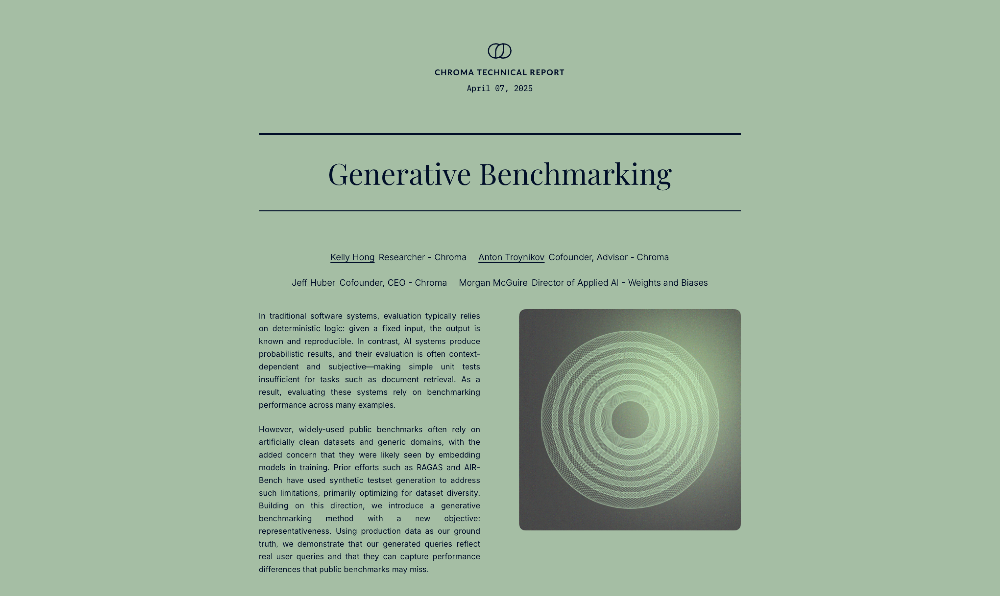

# Generative Benchmarking



This project provides a comprehensive toolkit for generating custom benchmarks and replicating the results outlined in our [technical report](https://research.trychroma.com/generative-benchmarking).

## Motivation

Benchmarking is used to evaluate how well a model is performing, with the aim to generalize that performance to broader real-world scenarios. However, the widely-used benchmarks today often rely on artificially clean datasets and generic domains, with the added concern that they have likely already been seen by embedding models in training.

We introduce generative benchmarking as a way to address these limitations. Given a set of documents, we synthetically generate queries that are representative of the ground truth.


## Overview
This repository offers tools to:
- **Generate Custom Benchmarks:** Generate benchmarks tailored to your data and use case
- **Align LLMs:** Align your LLM judge to human preferences using an adapted version of [EvalGEN](https://arxiv.org/pdf/2404.12272)
- **Compare Results:** Compare metrics from your generated benchmark
- **Replicate Results:** Follow our guided notebooks to replicate the results presented in our technical report

## Repository Structure

- **`generate_benchmark.ipynb`**  
  A comprehensive guide to generating a custom benchmark based on your data

- **`align_llm.ipynb`**  
  This notebook walks you through aligning the LLM judge to your specific use case

- **`compare.ipynb`**  
  A framework for comparing results, which is useful when evaluating different embedding models or configurations

- **`replicate_results.ipynb`**  
  A guide to replicating the experiments and results from our technical report

- **`data\`**  
  Example data to immediately test out the notebooks with

- **`functions\`**  
  Functions used to run notebooks, includes various embedding functions and llm prompts

- **`results\`**  
  Folder for saving benchmark results, includes results produced from example data


## Installation

### pip

```bash
pip install -r requirements.txt
```

### poetry
```bash
poetry install
```

### conda
```bash
conda env create -f environment.yml
conda activate generative-benchmarking-env
```

## Citation

If you use this package in your research, please cite our technical report:

```
@techreport{hong2025benchmarking,
  title = {Generative Benchmarking},
  author = {Hong, Kelly and Troynikov, Anton and Huber, Jeff and McGuire, Morgan},
  year = {2025},
  month = {April},
  institution = {Chroma},
  url = {https://research.trychroma.com/generative-benchmarking},
}
```